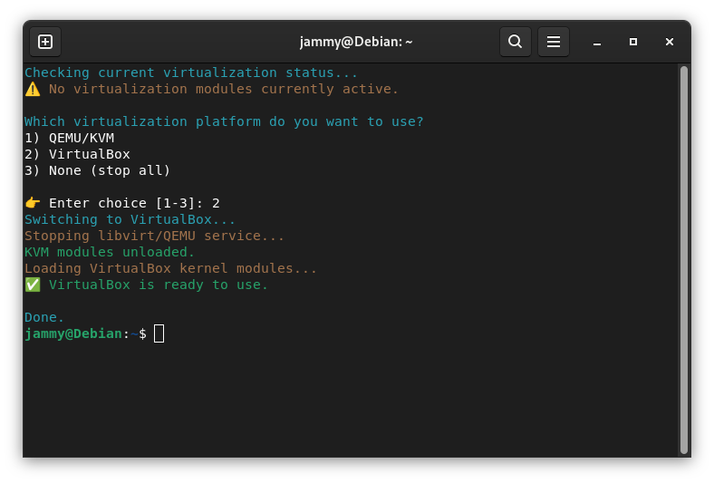
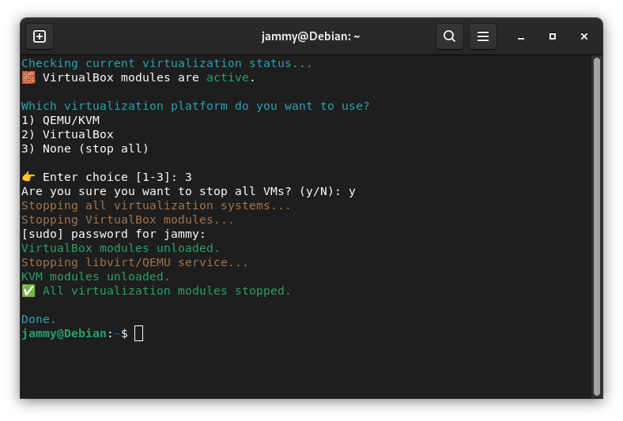

# Switch-VM-Script
For Linux system based
## Download and setup

Clone the script:
```
git clone git@github.com:jammyjunior/Switch-VM-Script.git
```


Then navigate to the script folder.

### Make it executable (gain permission):
```
chmod +x ~/switch-vm
```
### Optional: Call it anywhere
Move it to the path:
```
sudo mv ~/switch-vm /usr/local/bin/switch-vm
```
So you can call it anywhere on your system. You can also change the script name. </br>
Next time you just need to type:
```
switch-vm
```


## Screenshots


